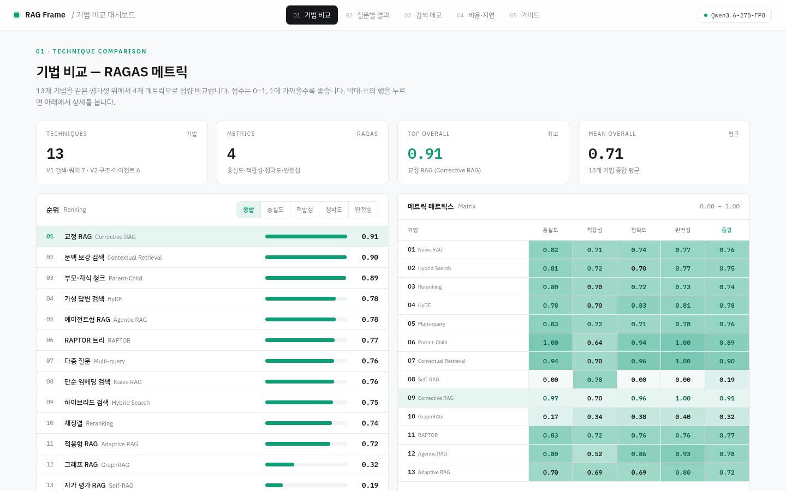

# 🔎 RAG Frame

RAG (Retrieval-Augmented Generation) 기법 13종을 한 곳에서 비교하고 RAGAS로 정량 평가하는 학습용 레퍼런스 갤러리입니다.



13개 기법의 RAGAS 4 메트릭 (충실도 / 적합성 / 정확도 / 완전성) 순위와 매트릭스를 한 눈에 비교하고, 기법별 디테일과 레이더 차트로 강약점을 살펴볼 수 있습니다.

## 🔹 1. 이 레포의 목적

1. 대표적인 RAG 기법을 동일한 데이터셋 위에서 비교 가능한 형태로 모아둡니다
2. 각 기법을 최소 코드로 구현해 학습 자료로 사용합니다
3. RAGAS 평가 하네스를 같이 두어 "어떤 기법이 우리 데이터에 맞나" 의사결정을 돕습니다

## 🔹 2. 포함된 기법

V1 - 검색 강화/쿼리/청킹

1. Naive RAG - 단순 임베딩 + top-k 검색의 베이스라인
2. Hybrid Search - BM25(Kiwi 형태소 분석) + Dense 임베딩을 RRF로 결합
3. Reranking - 1차 검색 결과를 BGE-reranker-v2로 재정렬
4. HyDE - 가설 답변 생성 후 그 임베딩으로 검색
5. Multi-query - 질문을 여러 표현으로 확장해 검색 결과를 합침
6. Parent-child Chunking - 작은 청크로 검색하고 부모 청크로 컨텍스트 확장
7. Contextual Retrieval - Anthropic 2024.09 기법, 각 청크에 문서 컨텍스트를 prepend

V2 - 자가 교정/구조 인덱싱/에이전트

8. Self-RAG - LLM이 검색 필요 여부와 결과 유용성을 자가 평가 후 필터링
9. CRAG (Corrective RAG) - 검색 결과 신뢰도 평가 후 부족 시 질문 재작성/재검색
10. GraphRAG (미니멀) - 엔티티/관계 그래프 + 커뮤니티 요약 인덱싱
11. RAPTOR - 청크 클러스터링 + LLM 요약으로 깊이 3 트리 인덱스
12. Agentic RAG (ReAct) - LLM이 search/calc 도구를 능동적으로 호출
13. Adaptive RAG - 질문 복잡도(simple/single-hop/multi-hop) 분류 후 전략 분기

## 🗂️ 3. 디렉토리 구조

```
07_rag-frame/
├── common/                 공통 모듈 (임베딩/청크/LLM/벡터DB/usage 추적)
├── data/sample/            한국어/영어 작은 위키 샘플
├── techniques/             기법별 독립 구현 13개 (RAG 인터페이스 통일)
├── evaluation/             RAGAS 평가 하네스 + 비교 도구
├── dashboard/              Streamlit 비교 대시보드 (V3)
├── designsite/             정적 비교 대시보드 (V5, React + Babel CDN)
├── docs/                   설계 문서 + 기법 비교 + 통합 references (캡처 이미지 포함)
├── scripts/                초기화/데이터 다운로드/디자인 데이터 빌드 스크립트
├── docker-compose.yml      Qdrant 벡터 DB + Streamlit + designsite 컨테이너
├── pyproject.toml          uv 패키지 관리
└── .env.example            API 키 템플릿
```

## ⚙️ 4. 설치 및 실행

1. 사전 준비
   1) Docker Desktop 실행 중일 것 (Qdrant 컨테이너용)
   2) Python 3.11 이상 (conda / venv / uv 중 환경 매니저 한 가지)
   3) LLM API 키 - 미스트랄(권장, 가성비 좋음) 또는 오픈AI 또는 앤트로픽 중 한 가지
   4) 임베딩/리랭커는 로컬 모델(BGE-M3, BGE-reranker)로 무료 실행

2. 단계
   1) `cp .env.example .env` (윈도우는 `copy`) 후 .env 안에 API 키 입력
   2) 의존성 설치 - 환경에 맞춰 한 가지 선택
      - conda 사용 시 : `conda create -n rag-frame python=3.11 -y && conda activate rag-frame && pip install -e .`
      - uv 사용 시 : `uv sync`
      - 일반 venv : `python -m venv .venv && source .venv/bin/activate (윈도우는 .venv\Scripts\activate) && pip install -e .`
   3) `docker compose up -d` Qdrant 실행
   4) `python scripts/download_data.py` 샘플 데이터 준비 (선택, uv 환경은 `uv run` 접두)
   5) `python techniques/01-naive/rag.py` 기법별 단독 실행
   6) `python evaluation/ragas_eval.py --technique 01-naive` 평가 실행
   7) `streamlit run dashboard/app.py` 대시보드 실행 (V3)
   8) 정적 비교 대시보드 (V5) 실행 — `python scripts/build_design_data.py` 로 designsite/data/rag_data.js 갱신 후 `docker compose up -d designsite`

3. 환경별 명령어 차이
   1) conda + pip 사용자 - 위 명령들 그대로 `python ...`, `streamlit run ...` 으로 호출
   2) uv 사용자 - 모든 명령 앞에 `uv run` 접두 (예: `uv run python ...`)
   3) GPU PyTorch가 필요하면 conda 사용자는 `pip install -e .` 전에 `conda install pytorch torchvision pytorch-cuda=12.1 -c pytorch -c nvidia` 먼저 실행

4. LLM 공급자 선택 (.env 의 LLM_PROVIDER)
   1) `mistral` (기본 권장) - mistral-small-latest 생성 + mistral-large-latest 평가. 가성비 좋고 한국어 무난
   2) `openai` - gpt-4o-mini 생성 + gpt-4o 평가. 평가 정확도는 약간 더 좋지만 비용 큼
   3) `anthropic` - Claude 사용. 한국어 품질 좋지만 RAGAS 평가 호환성 검증 필요
   4) 임베딩/리랭커는 공급자와 무관하게 로컬 BGE 모델 사용

## 📈 5. 평가 흐름

1. `evaluation/questions.jsonl` 에 질문/정답/참조 컨텍스트가 담겨 있습니다
2. `ragas_eval.py` 가 지정 기법의 RAG 파이프라인을 호출해 답변을 생성합니다
3. RAGAS 메트릭(Faithfulness, Answer Relevancy, Context Precision, Context Recall) 4종을 계산합니다
4. 결과는 `evaluation/results/<기법명>-<날짜>.json` + markdown 리포트로 저장됩니다
5. `evaluation/compare.py` 로 여러 기법의 결과를 한 리포트로 모읍니다

## 🔹 6. 한계 및 주의 사항

1. 본 레포는 학습/시연 목적입니다. 프로덕션 시작점으로 쓰려면 에러 처리, 동시성, 캐시, 인증 등을 추가해야 합니다
2. 한국어 데이터에서 각 기법의 상대 성능 데이터는 영어 대비 적습니다. 점수는 본인 도메인 데이터로 직접 벤치마크하는 것을 권장합니다
3. RAGAS는 LLM 호출이 많아 평가 1회에 수십 센트에서 수 달러까지 비용이 발생할 수 있습니다. 평가용 LLM과 호출 횟수를 미리 점검하세요
4. V2 기법(GraphRAG, RAPTOR, Self-RAG, CRAG, Agentic, Adaptive)은 단순화 버전입니다. 원논문 풀스펙은 비용/구현 복잡도가 훨씬 큽니다

## 🔹 7. 다음 단계 (로드맵)

1. V3 (완료) - Streamlit 비교 대시보드 + 평가 결과 시각화 + 토큰/비용 추적
2. V4 (완료) - 한국어 위키 샘플 데이터셋 (98 docs / 30 questions) + Qwen3.6-27B-FP8 평가 결과 13 기법 적재
3. V5 (완료) - 정적 비교 대시보드 designsite (React + Babel CDN, 5 페이지 - 기법 비교 / 질문별 결과 / 검색 데모 / 비용 지연 / 가이드)
4. V6 - GraphRAG 풀스펙 (Leiden 계층 커뮤니티), RAPTOR GMM/UMAP 변종, prompt caching 적용
5. V7 - 멀티모달 RAG (이미지/표 포함)
