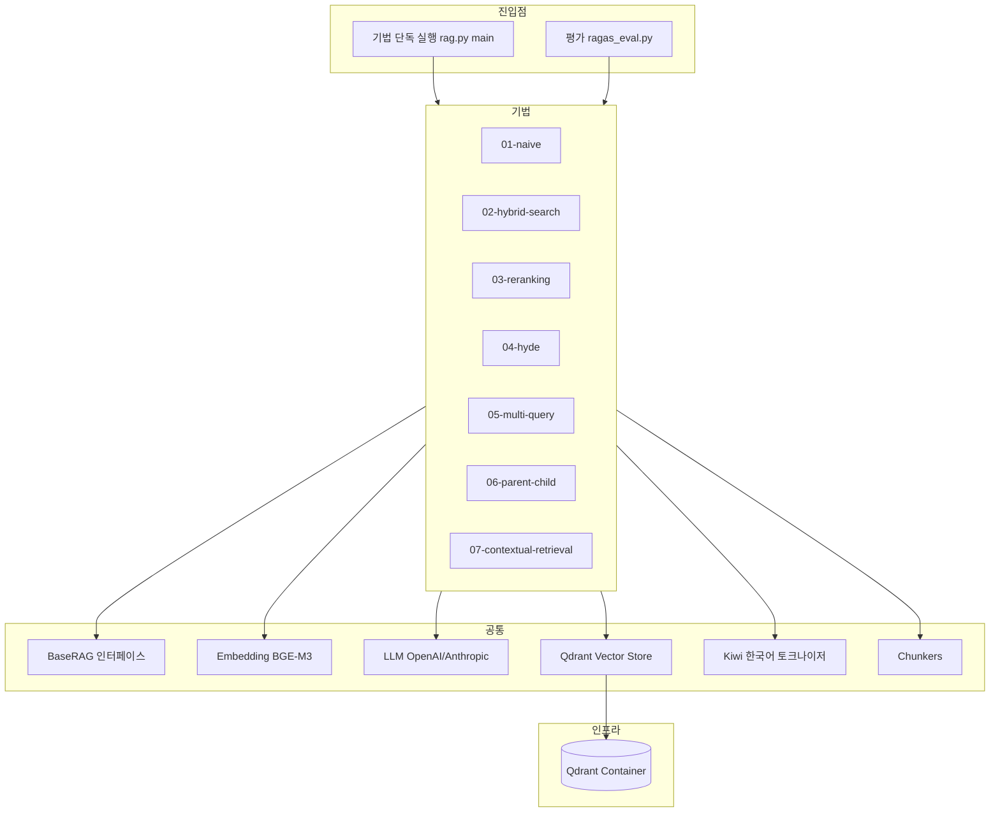
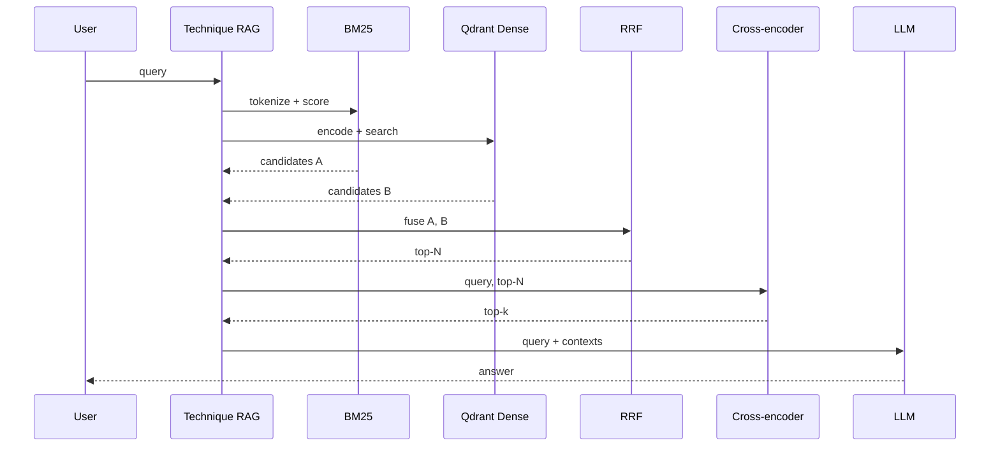
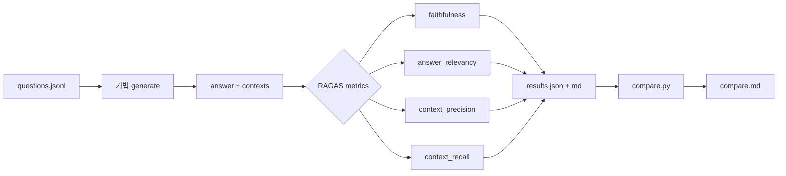
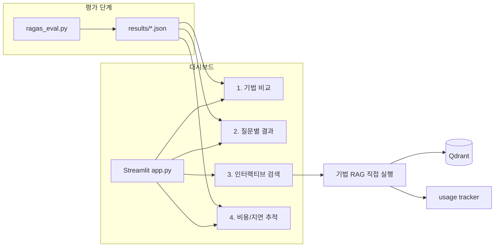

# 아키텍처

본 레포는 학습/시연 갤러리 + 평가 하네스 결합 구조입니다. 각 기법은 독립 폴더에 자체 완결적으로 구현되어 있어 한 파일만 읽어도 전체 흐름이 보이도록 설계되었습니다.

## 1. 레이어 구조

## 2. 공통 인터페이스

모든 기법은 `common/base.py:BaseRAG` 를 상속해 다음 메서드를 구현합니다.

1. `build_index(documents)` - 문서 리스트를 받아 인덱스 구축
2. `retrieve(query, top_k)` - 질문에 대해 top-k 청크 반환
3. `generate(query, top_k)` - retrieve 후 LLM 호출까지 한 번에

이 통일된 인터페이스 덕분에 평가 하네스가 기법명만 바꿔 동일하게 호출할 수 있습니다.

## 3. 데이터 흐름 (예: Hybrid + Reranking 결합 가정)

## 4. 평가 흐름

## 5. 디렉토리 매핑

1. common/ - 모든 기법이 공유하는 빌딩 블록 (인터페이스, 임베딩, LLM, 벡터 저장소, 청크, 한국어 토크나이저, 설정, usage 추적)
2. data/sample/ - 한국어 15문서 + 영어 15문서 작은 데모셋
3. techniques/NN-name/ - 기법별 독립 구현 13개. rag.py 한 파일에 build_index/retrieve/generate 다 있음
4. evaluation/ - 질문 셋, 평가 스크립트, 비교 도구
5. dashboard/ - Streamlit 비교 대시보드 (4페이지)
6. docs/ - 본 문서 + overview + technique-comparison + references
7. scripts/ - 데이터 다운로드 같은 보조 스크립트

## 6. 대시보드 흐름 (V3)

페이지 1, 2, 4는 저장된 평가 결과(JSON)를 그대로 읽어 표시합니다. 페이지 3은 실시간으로 RAG 인스턴스를 빌드하고 인덱싱한 뒤 사용자 질문에 답변합니다.
