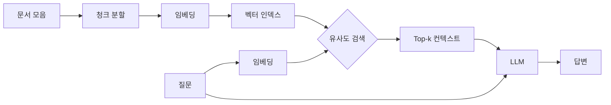

# RAG 개요

이 문서는 처음 RAG를 공부하는 사람을 위해 본 레포에 포함된 기법들의 큰 그림을 정리합니다.

## 1. RAG가 풀려는 문제

대형 언어 모델은 학습 시점 이후의 정보를 모르고, 모델 매개변수에 모든 사실을 정확히 담을 수 없어 환각(hallucination)을 일으킵니다. RAG는 질문이 들어왔을 때 외부 지식 베이스에서 관련 문서를 검색하고, 그 문서를 컨텍스트로 함께 넣어 LLM이 사실 기반으로 답하게 만드는 패턴입니다.

## 2. 기본 RAG 파이프라인

## 3. 본 레포가 다루는 개선 축

V1 (검색/쿼리/청킹 강화)

1. 검색 다양화 (어휘 + 의미)
   1) Hybrid Search - BM25와 임베딩을 RRF로 결합
2. 검색 정밀도 향상
   1) Reranking - cross-encoder로 1차 결과 재정렬
3. 질문 처리
   1) HyDE - 가설 답변으로 검색
   2) Multi-query - 질문을 여러 표현으로 확장
4. 청킹/인덱싱
   1) Parent-Child - 작은 청크로 검색, 큰 청크로 컨텍스트
   2) Contextual Retrieval - 청크에 문서 맥락을 prepend

V2 (자가 교정 + 구조 인덱싱 + 에이전트)

5. 자가 교정 / 평가
   1) Self-RAG - 검색 필요 여부와 청크 유용성을 LLM이 자가 평가
   2) CRAG - 검색 신뢰도 평가 후 부족하면 재작성/재검색
6. 구조 인덱싱
   1) GraphRAG - 엔티티 그래프 + 커뮤니티 요약 (요약형 질문 강점)
   2) RAPTOR - 청크 클러스터링 + 다단계 요약 트리
7. 에이전트형
   1) Agentic RAG (ReAct) - 도구를 LLM이 능동 호출
   2) Adaptive RAG - 질문 복잡도 분류 후 전략 분기

## 4. 각 기법이 풀려는 약점

1. Naive RAG의 약점 - 어휘 매칭 약함, 모호한 청크, 단순 의미 매칭
2. Hybrid Search - 어휘 매칭 약점 해결
3. Reranking - bi-encoder의 매칭 한계 해결
4. HyDE - 질문/답변 어휘 분포 차이 해결
5. Multi-query - 짧고 모호한 질문의 회수율 부족 해결
6. Parent-Child - 작은 청크의 컨텍스트 부족 해결
7. Contextual Retrieval - 청크 단독의 의미 모호성 해결
8. Self-RAG - 항상 검색하는 비효율 + 무관 청크의 환각 유발
9. CRAG - 검색 실패 시 그대로 답변하는 약점 해결
10. GraphRAG - 청크 기반 RAG가 전체 조망 질문에 약한 점 해결
11. RAPTOR - 장문/다중 문서 QA에서 디테일/요약 동시 활용
12. Agentic RAG - 다단계/혼합 추론과 도구 사용
13. Adaptive RAG - 모든 질문에 동일 전략을 적용하는 비효율 해결

## 5. 비용/지연 트레이드오프

1. 추가 LLM 호출이 있는 기법 - HyDE, Multi-query, Contextual Retrieval (인덱싱 시점)
2. 추가 모델 호출이 있는 기법 - Reranking (cross-encoder)
3. 인덱싱 비용이 큰 기법 - Contextual Retrieval (문서당 청크 수 * LLM 호출)
4. 추론 시점은 비슷한 기법 - Hybrid Search, Parent-Child (추가 LLM 호출 없음)

## 6. 추천 시작 순서

1. Naive RAG로 베이스라인 점수 확보
2. Hybrid Search 추가 - 한국어 환경에서 가장 큰 효과
3. Reranking 추가 - 검색 정밀도가 답 품질의 병목이면 적용
4. Contextual Retrieval - 청크 단독으로 모호한 도메인(법률, 의료, 사내 메뉴얼)에서 효과 큼
5. HyDE / Multi-query - 사용자 질문이 짧거나 모호할 때 추가
6. Parent-Child - LLM이 컨텍스트 부족으로 답을 못 만들 때 적용

## 7. 다음 학습 자료

1. Anthropic Contextual Retrieval 글 - https://www.anthropic.com/news/contextual-retrieval
2. LangChain RAG cookbook - https://python.langchain.com/docs/tutorials/rag/
3. Pinecone Learn RAG - https://www.pinecone.io/learn/series/rag/
4. Lewis et al. 원논문 (RAG, 2020) - https://arxiv.org/abs/2005.11401
