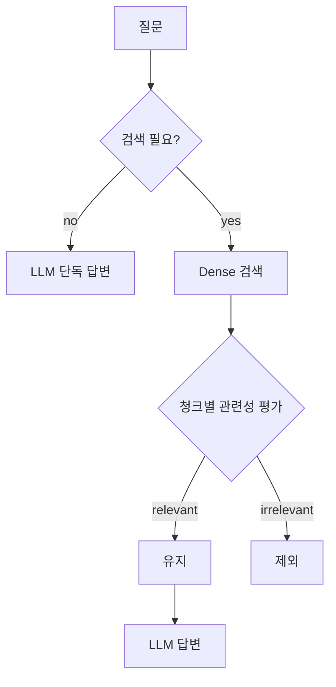

# 08. Self-RAG (단순화 버전)

LLM이 두 가지 판단을 자가 수행하는 RAG입니다.
1. 질문에 검색이 필요한지 판단
2. 검색된 각 청크가 질문에 실제 관련 있는지 판단 (필터링)

## 1. 원논문과의 차이

1. 원논문 (Asai et al., 2023) - reflection token을 별도 fine-tune으로 학습 (Retrieve/IsRel/IsSup/IsUse 4종 토큰)
2. 본 구현 - generalist LLM (GPT-4o)에 같은 의사결정을 프롬프트로 시키는 단순 버전
3. 학습 비용 없이 동작하지만 reflection 정확도는 fine-tuned 모델보다 낮을 수 있습니다

## 2. 동작 원리



## 3. 강점과 약점

강점
1. 단순 질문(산수, 메타)에 불필요한 검색 호출을 줄여 비용 절감
2. 검색이 빗나간 청크를 LLM 단계 전에 제거해 환각 감소
3. 다른 기법과 결합하기 쉬움 (Hybrid + Self-RAG 등)

약점
1. 청크당 LLM 호출이 1회 추가되어 평균 비용 증가 (대신 검색 불필요 시 호출 0)
2. 분류 LLM의 정확도에 의존 - small 모델 사용 시 false negative 위험
3. 한국어/영어 prompt 분기를 따로 잘 잡지 않으면 분류 품질이 떨어집니다

## 4. 실행

```bash
docker compose up -d
uv run python techniques/08-self-rag/rag.py
```

## 5. 변형

1. 평가 LLM과 답변 LLM 분리 - 평가는 mini 모델로 비용 절감
2. 관련성 등급을 binary 대신 1-5 score로 받고 임계값 튜닝

## 6. 참고 (References)

1. Asai, A., Wu, Z., Wang, Y., Sil, A., & Hajishirzi, H. (2023). "Self-RAG: Learning to Retrieve, Generate, and Critique through Self-Reflection." - https://arxiv.org/abs/2310.11511
2. 공식 구현 - https://github.com/AkariAsai/self-rag
3. 통합 인용은 docs/references.md 의 "5-1. Self-RAG" 참조
