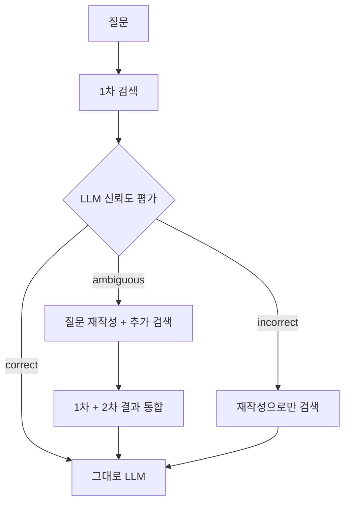

# 09. CRAG (Corrective RAG)

검색 결과의 신뢰도를 평가해 correct / ambiguous / incorrect 세 단계로 분기 처리합니다.

## 1. 동작 원리



## 2. 원논문과의 차이

1. 원논문 (Yan et al., 2024) - retrieval evaluator를 별도 학습 + 부족 시 웹 검색 fallback
2. 본 구현 - 평가자를 프롬프트 기반 LLM으로 단순화. fallback은 질문 재작성 후 재검색으로 갈음 (웹 검색 미포함)

## 3. 강점과 약점

강점
1. 검색 실패 시 질문을 다시 써서 재검색하므로 회수율이 안정적
2. 신뢰도 라벨이 명시적이라 디버깅 쉬움
3. 모듈 단위 결합이 가능 (평가자만 교체, 검색기만 교체)

약점
1. LLM 호출이 평가 1회 + 재작성 1회 (필요 시)로 비용 증가
2. 평가자 정확도가 전체 품질을 좌우 - small 모델 사용 시 ambiguous 남발 가능성
3. 웹 검색 fallback이 없으면 진짜로 코퍼스에 없는 정보에는 무력

## 4. 실행

```bash
docker compose up -d
uv run python techniques/09-crag/rag.py
```

## 5. 변형

1. incorrect 시 웹 검색 API (Tavily, Brave Search) 호출 추가
2. 평가자를 별도 lightweight 분류기로 교체 (DistilBERT 등)
3. ambiguous 단계에서 Multi-query처럼 변형을 여러 개 만들어 합치기

## 6. 참고 (References)

1. Yan, S., Gu, J., Zhu, Y., & Ling, Z. (2024). "Corrective Retrieval Augmented Generation." - https://arxiv.org/abs/2401.15884
2. 공식 구현 - https://github.com/HuskyInSalt/CRAG
3. 통합 인용은 docs/references.md 의 "5-2. CRAG" 참조
