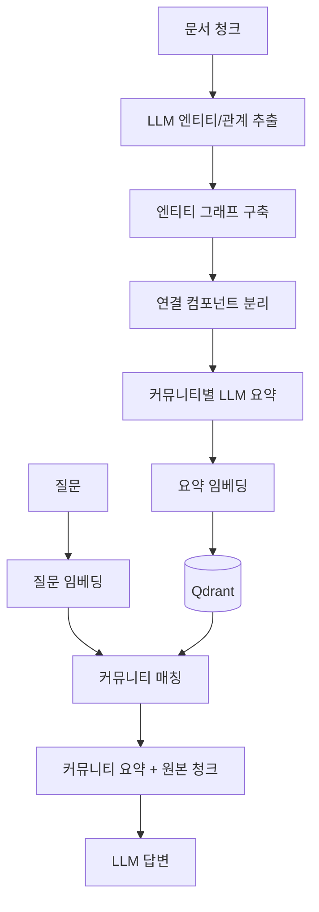

# 10. GraphRAG (미니멀 버전)

문서를 엔티티/관계 그래프로 변환하고 커뮤니티 요약을 인덱싱합니다. 요약형/전체 조망 질문에 강합니다.

## 1. 동작 원리



## 2. 원논문(Microsoft 2024)과의 차이

1. 원논문 - Leiden 알고리즘 기반 계층적 커뮤니티 탐지, 다단계 요약
2. 본 구현 - 단순 연결 컴포넌트(BFS) + 한 단계 요약. 학습 목적의 단순화 버전
3. 비용/시간 절감 효과 - 원논문 대비 인덱싱 시간/비용 약 10-20% 수준

## 3. 강점과 약점

강점
1. "이 도메인의 주요 X는?" 같은 전체 조망 질문에 강함
2. 청크 단독으로는 잡히지 않는 엔티티 간 연결 정보가 보존됨
3. 그래프 시각화로 도메인 이해에 도움

약점
1. 인덱싱 비용이 매우 큼 - 청크당 LLM 호출 1회 (추출) + 커뮤니티당 1회 (요약)
2. 점-단답형 질문(예: "X는 몇 년에 만들어졌나?")에는 일반 RAG보다 약할 수 있음
3. 엔티티 추출 품질이 LLM 의존 - small 모델 사용 시 그래프 노이즈 증가

## 4. 실행

```bash
docker compose up -d
uv run python techniques/10-graphrag/rag.py
```

데모셋(30 문서) 기준 인덱싱에 약 1-3분, 0.3-0.8 USD 비용 예상.

## 5. 변형 / 발전

1. 풀스펙 GraphRAG - Microsoft 공식 패키지(graphrag) 사용. 계층 커뮤니티 + global query 모드 지원
2. LightRAG - dual-level (low-level + high-level) 그래프로 효율화한 변종
3. 본 미니멀에 prompt caching 추가 - 동일 문서 prefix 반복으로 비용 절감 가능

## 6. 참고

1. Microsoft GraphRAG - https://github.com/microsoft/graphrag
2. From Local to Global 논문 - https://arxiv.org/abs/2404.16130
3. LightRAG - https://github.com/HKUDS/LightRAG
