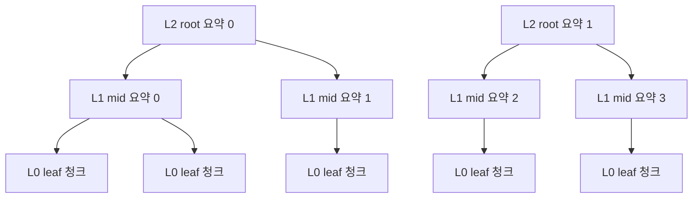

# 11. RAPTOR

청크를 클러스터링하고 LLM으로 요약해 트리를 만드는 인덱싱 기법입니다. 본 구현은 깊이 3단계입니다.

## 1. 트리 구조



검색 시 모든 레벨에 동시 질의하고 점수 순으로 통합합니다. 디테일이 필요하면 L0이, 요약이 필요하면 L1/L2가 자연스럽게 선택됩니다.

## 2. 동작 원리

1. 모든 청크를 임베딩 (L0)
2. L0 임베딩을 K-Means로 클러스터링
3. 각 클러스터의 청크들을 LLM으로 요약 (L1)
4. L1 임베딩을 다시 클러스터링
5. 각 L1 클러스터를 다시 요약 (L2)
6. L0/L1/L2 모두 같은 Qdrant 컬렉션에 색인
7. 질문 검색 시 모든 레벨에서 결과를 가져와 점수 순 top-k 반환

## 3. 원논문(Sarthi et al., 2024)과의 차이

1. 원논문 - GMM soft clustering + UMAP 차원 축소
2. 본 구현 - KMeans hard clustering, 원본 임베딩 그대로
3. 차이는 보통 -5%~ +5% 수준 (도메인에 따라). 학습 목적상 단순화 우선

## 4. 강점과 약점

강점
1. 장문/다중 문서 QA에서 강함 - 상위 레벨이 글로벌 컨텍스트 제공
2. 디테일/요약 매칭이 한 인덱스에서 자연스럽게 처리됨
3. 구현이 직관적

약점
1. 인덱싱 시 LLM 요약 호출 비용 (클러스터 수만큼)
2. 클러스터 수 하이퍼파라미터(n_mid, n_root)에 민감
3. 작은 데이터셋에서는 L2 root가 과한 추상화로 무의미할 수 있음

## 5. 실행

```bash
docker compose up -d
uv run python techniques/11-raptor/rag.py
```

데모셋 기준 인덱싱 약 20-40초, 비용 약 0.1-0.3 USD.

## 6. 참고

1. 원논문 - https://arxiv.org/abs/2401.18059
2. 공식 구현 - https://github.com/parthsarthi03/raptor
