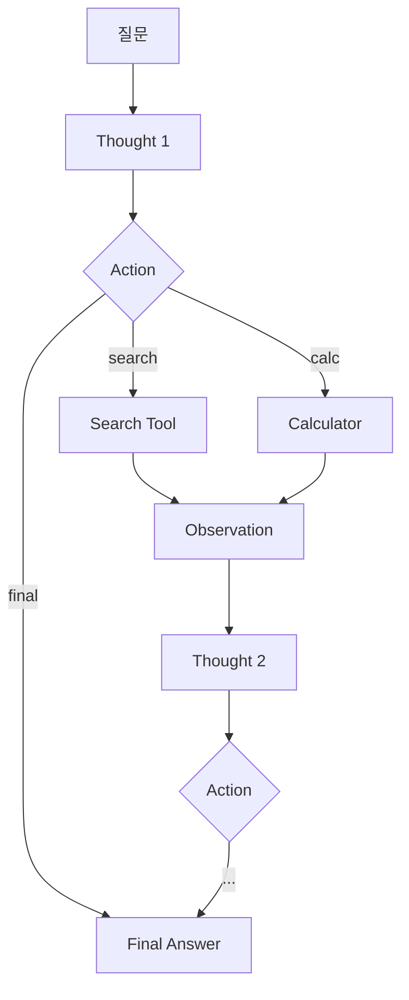

# 12. Agentic RAG (ReAct 스타일)

LLM이 search/calc 같은 도구를 능동적으로 선택해 다단계 추론으로 답변을 만듭니다.

## 1. 동작 원리

ReAct 패턴 - Thought → Action → Observation 반복.



## 2. 제공 도구

1. search(query) - 지식 베이스 검색 (Qdrant 임베딩)
2. calc(expression) - 산수 계산 (정규식으로 입력 제한)
3. final(answer) - 최종 답변 종료

## 3. 강점과 약점

강점
1. 다단계/혼합 추론 질문에 강함 (검색 + 계산 + 비교)
2. 검색 결과가 부족하면 더 좋은 키워드로 다시 검색 (회수 보강)
3. 도구를 추가하면 능력 확장이 직선적 (이메일, 캘린더, 코드 실행 등)

약점
1. LLM 호출 수가 가변적이고 평균 3-5배 (지연 + 비용 증가)
2. 도구 파싱 오류로 무한 루프 위험 - max_steps 설정 필수
3. small 모델은 ReAct 형식 준수가 약함 - GPT-4 급 권장

## 4. 실행

```bash
docker compose up -d
uv run python techniques/12-agentic-rag/rag.py
```

## 5. 실무 권장 사항

1. 본 구현은 텍스트 파싱 기반이라 학습용입니다. 실제로는 OpenAI / Anthropic의 function calling API 사용 권장
2. 도구 결과 길이를 잘라 컨텍스트 폭발을 막아야 함 (각 Observation max 1k 토큰 정도)
3. 도구 호출 횟수에 비용 한도 두기 (예: 한 질문당 5회 초과 시 강제 final)

## 6. 참고

1. ReAct 원논문 (Yao et al., 2022) - https://arxiv.org/abs/2210.03629
2. OpenAI function calling - https://platform.openai.com/docs/guides/function-calling
