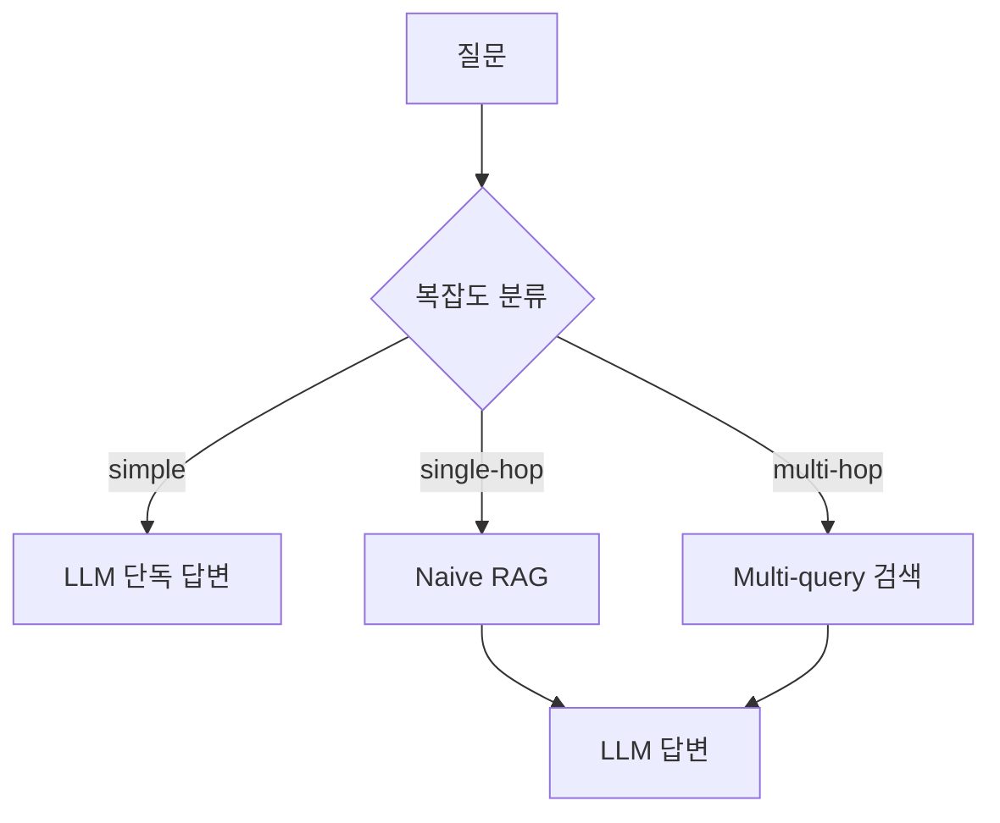

# 13. Adaptive RAG

질문의 복잡도를 먼저 분류해 simple / single-hop / multi-hop 세 갈래로 다른 전략을 적용합니다.

## 1. 동작 원리



## 2. 분기 기준

1. simple - 외부 지식 검색이 불필요. 산수, 일반 상식, 메타 질문 → LLM 단독 답변
2. single-hop - 한 번의 검색으로 답이 나옴. 사실 조회 → Naive RAG
3. multi-hop - 여러 문서 종합이나 단계 추론 필요 → 질문 변형 3개 + RRF/dedup

## 3. 강점과 약점

강점
1. 질문별로 최소 비용 경로를 자동 선택
2. simple 질문에 검색 호출을 생략해 평균 지연 감소
3. multi-hop 질문에 회수율 향상

약점
1. 분류 LLM 호출이 항상 1회 추가됨 - simple 질문에서는 약간의 오버헤드
2. 분류기 오분류 시 부적절한 전략 선택 - 특히 multi-hop을 single-hop으로 보면 답 부정확
3. 본 구현은 분류기를 fine-tune하지 않아 원논문 대비 정확도 낮음

## 4. 실행

```bash
docker compose up -d
uv run python techniques/13-adaptive-rag/rag.py
```

## 5. 참고

1. 원논문 (Jeong et al., 2024) - https://arxiv.org/abs/2403.14403
2. LangGraph Adaptive RAG 가이드 - https://langchain-ai.github.io/langgraph/tutorials/rag/langgraph_adaptive_rag/
